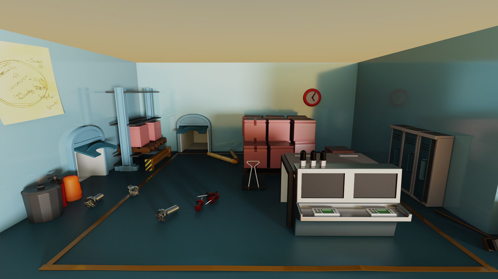
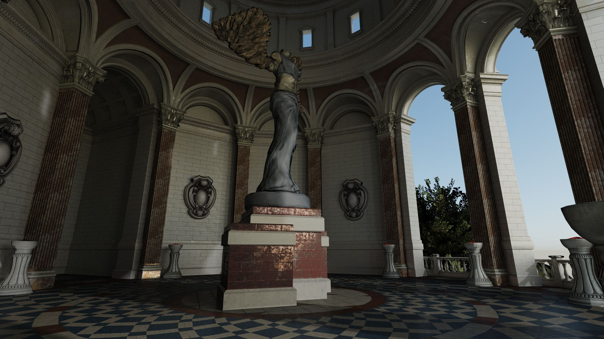
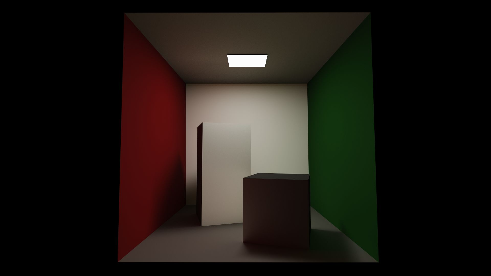
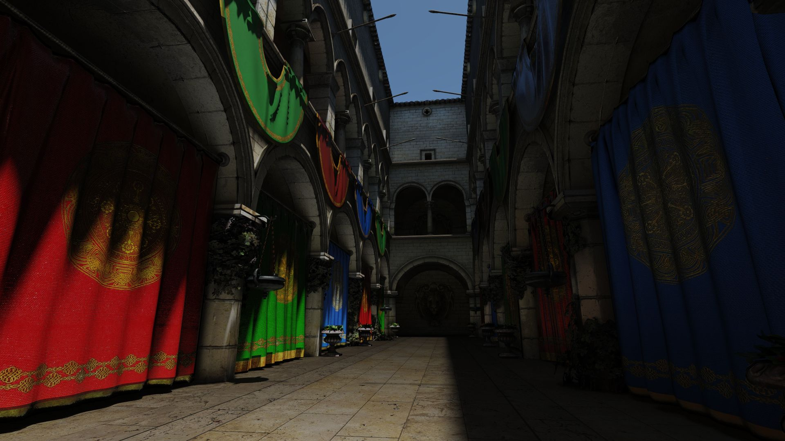

[](https://opensource.org/licenses/MIT)

# Helios
A real-time unidirectional GPU path tracer using the cross-vendor Vulkan ray-tracing extensions.










## Features
* Real-time progressive rendering
* Tiled rendering
* Standalone Editor and Viewer applications
* Image Based Lighting
* Area Lights
* Punctual Lights
* Next Event Estimation
* Russian roulette path termination
* Alpha-testing via Any-hit shaders
* Hosek-wilkie procedural sky
* ACES tone mapping
* GPU Profiling

## Usage

1. Download the latest release [here](https://github.com/diharaw/Helios/releases/download/1.0.0/Helios_1.0.0.zip).
2. Extract archive contents.
3. Run HeliosViewer.exe or HeliosEditor.exe.
4. Open a sample scene located in the *<helios_root>/assets/scene* folder via the file open prompt at startup.

### Controls

* `W`/`A`/`S`/`D` - camera movement.
* `RMB` - hold to look around.
* `G` - toggle UI.
* `ESC` - close application.

## Building

### Windows
Tested on: Windows 10 version 2004

Prerequisites
* MSVC 19.00 or higher
* CMake 3.8 or higher
* Vulkan SDK 1.2.162.0 or higher

```
git clone --recursive https://github.com/diharaw/Helios.git
cd Helios
mkdir build
cd build
cmake -G "Visual Studio 16 2019" ..
```
## System Requirements

A GPU that supports the following Vulkan Extensions:

* VK_KHR_ray_tracing_pipeline
* VK_KHR_acceleration_structure
* VK_EXT_descriptor_indexing

Requires the latest NVIDIA/AMD drivers.

## Dependencies
* [glfw](https://github.com/glfw/glfw)
* [imgui](https://github.com/ocornut/imgui)
* [ImGuizmo](https://github.com/CedricGuillemet/ImGuizmo)
* [AssetCore](https://github.com/diharaw/AssetCore) 
* [nativefiledialog](https://github.com/mlabbe/nativefiledialog)
* [VulkanMemoryAllocator](https://github.com/GPUOpen-LibrariesAndSDKs/VulkanMemoryAllocator)
* [stb](https://github.com/nothings/stb)

## License
```
Copyright (c) 2020 Dihara Wijetunga

Permission is hereby granted, free of charge, to any person obtaining a copy of this software and 
associated documentation files (the "Software"), to deal in the Software without restriction, 
including without limitation the rights to use, copy, modify, merge, publish, distribute, sublicense,
and/or sell copies of the Software, and to permit persons to whom the Software is furnished to do so, 
subject to the following conditions:

The above copyright notice and this permission notice shall be included in all copies or substantial
portions of the Software.

THE SOFTWARE IS PROVIDED "AS IS", WITHOUT WARRANTY OF ANY KIND, EXPRESS OR IMPLIED, INCLUDING BUT NOT 
LIMITED TO THE WARRANTIES OF MERCHANTABILITY, FITNESS FOR A PARTICULAR PURPOSE AND NONINFRINGEMENT. 
IN NO EVENT SHALL THE AUTHORS OR COPYRIGHT HOLDERS BE LIABLE FOR ANY CLAIM, DAMAGES OR OTHER LIABILITY,
WHETHER IN AN ACTION OF CONTRACT, TORT OR OTHERWISE, ARISING FROM, OUT OF OR IN CONNECTION WITH THE 
SOFTWARE OR THE USE OR OTHER DEALINGS IN THE SOFTWARE.
```
